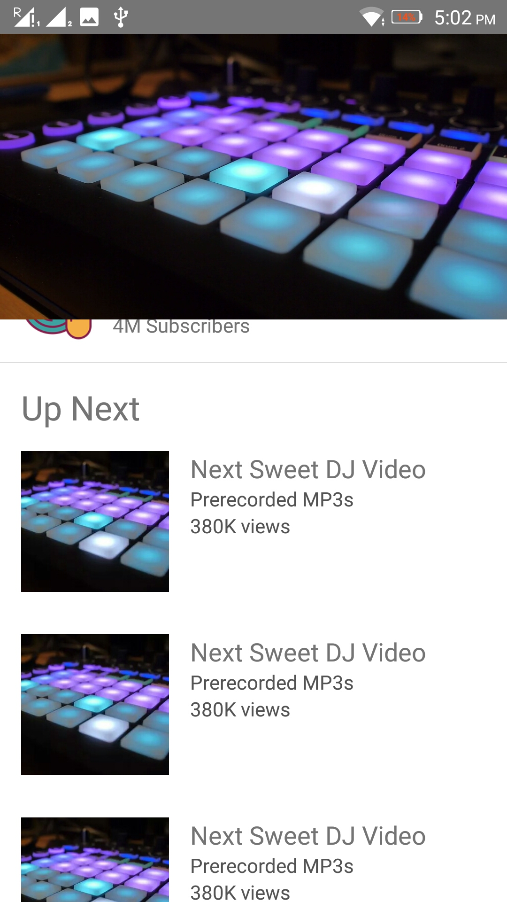

  

<h1 align="center"> Animated Youtube Page </h1>

A demo of design and functionality of a YouTube page built in React Native.
 
PS: Video, images, text are all hard-coded. Those can easily be replaced with content from an API.

# Screenshots

### Streaming video page with details

  

### Scroll view of upcoming videos below the current one

### Drag to minimise the video while it still plays, click on it to resize back to full screen

# Installation

* `git clone https://github.com/VinayakBagaria/Animated-Youtube-Page`
* `cd Animated-Youtube-Page && yarn` - installs dependencies for frontend serve
* `yarn run android` - run the app on android, via simulator or through USB.
* `yarn run ios` - run the app on ios simulator.

# What is used?

### Frameworks

* [React Native](https://facebook.github.io/react-native)

### Dependencies

* [React-Native-Video](https://github.com/react-native-community/react-native-video)
* [React-Native-Vector-Icons](https://github.com/oblador/react-native-vector-icons)

### Additional Tools

* [ESLint](https://eslint.org/) - Linter for JS and JSX
* [Prettier](https://prettier.io/) - Code formatter
* [Lint-Staged](https://github.com/okonet/lint-staged) - Runs Prettier against staged JS files
* [Husky](https://github.com/typicode/husky) - Runs Lint-Staged before git commits and push

# TODO

* [ ] Flow (React dependency for type management - installed but not used)
